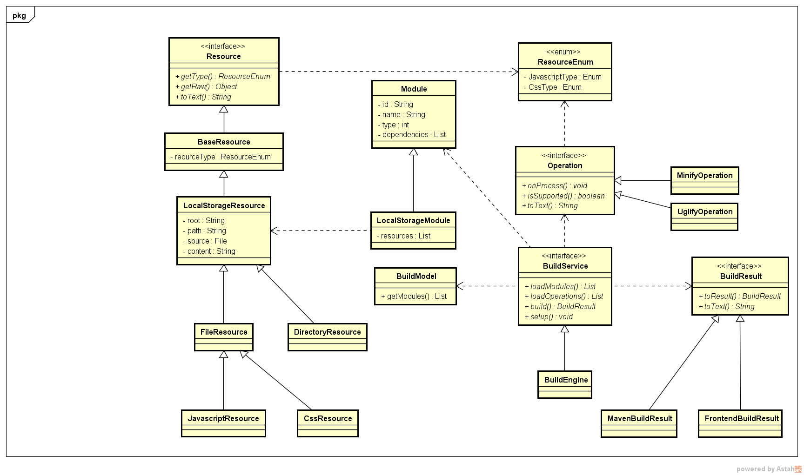

# ReleaseBuilder
A release builder by module,support common release tools(operation) minify、uglify and so on.

##arch

## How to

create a build service

	Builder builder = new Builder();

register build operations
	
	builder.registerOperation(new MinifyOperation());
	builder.registerOperation(new CopyOperation());

register build modules in background

	// code below just for demoing,auto parset folder to module is more productive
	LocalStorageModule registeModule = new LocalStorageModule();
	registeModule.setId("test");
	registeModule.setName("test");
	registeModule.setType("file");
	registeModule.setResources(resouces);
	...
	builder.registerModule(registeModule);
    ...
create simple module for build

	LocalStorageModule module = new LocalStorageModule();
	module.setId("image");

create module collection and add module

	List<LocalStorageModule> modules = new ArrayList<LocalStorageModule>();
	modules.add(module);
create build model and set modules

	LocalStorageBuildModel model = new LocalStorageBuildModel();
	model.setModules(modules);

build by model

	builder.build(model);

##What NEXT
- JDK8,Streaming programing support
- Maven pom scene support
- Web module support,programer can get what he want by http
- Add default strategy to parset folder files to LocalStorageModule easily

##Help
I really hope this program could help you in your work,make you have more free time get together with your family,your friend and your self.

If you have any other idea about this program,please tell me at the first time,i really happy to hear that.

thanks for your coming.